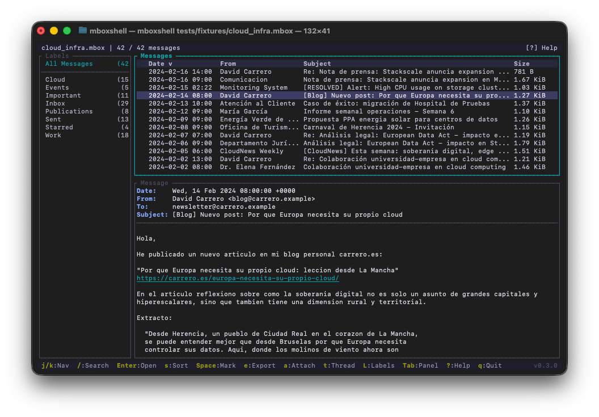

# mboxShell

**Visor rapido de terminal para archivos MBOX de cualquier tamano. Abre, busca y exporta correos de backups Gmail Takeout (50 GB+) sin cargarlos en memoria.**

[](LICENSE)
[](https://www.rust-lang.org)

[Read in English](README.md)

---

## Por que existe este proyecto

Cuando exportas tu correo de Gmail con Google Takeout, recibes uno o varios archivos `.mbox` que pueden pesar decenas de gigabytes. No existe una herramienta de terminal multiplataforma que permita abrir, buscar y consultar esos archivos de forma eficiente sin cargarlos enteros en memoria.

`mboxShell` nacio para resolver ese problema: abrir un MBOX de 50 GB en segundos, navegar entre cientos de miles de mensajes con fluidez, buscar por remitente, fecha o contenido, y exportar lo que necesites. Todo desde la terminal, sin interfaz grafica, sin servidor, sin dependencias externas.

## Casos de uso

- **Consultar backups de Gmail** (Google Takeout) con sus etiquetas originales
- **Analizar archivos de correo** en servidores, migraciones o auditorias
- **Buscar mensajes** en archivos MBOX de cualquier origen (Thunderbird, servidores Unix, etc.)
- **Exportar mensajes** a EML, CSV o texto plano para procesamiento posterior
- **Extraer adjuntos** de forma masiva o individual
- **Combinar varios MBOX** en uno solo, eliminando duplicados

## Tambien en Mac: mboxViewer

Si prefieres una experiencia grafica nativa en macOS, echa un vistazo a [mboxViewer](https://mboxviewer.net) — una app nativa para Mac creada por el mismo equipo. Ofrece una interfaz de buzon de correo familiar para abrir, explorar y buscar archivos MBOX sin necesidad de importarlos en un cliente de correo. Arrastra tu archivo `.mbox` y tendras acceso instantaneo a todos tus mensajes, adjuntos y etiquetas en una ventana nativa de macOS. Ideal para quienes quieren la potencia del motor de parsing de mboxShell con la comodidad de una interfaz de escritorio.

## Caracteristicas

- **No carga el archivo en memoria.** Usa lectura streaming con buffer de 1 MB. Un MBOX de 100 GB consume los mismos ~500 MB de RAM que uno de 1 GB (solo el indice de metadatos vive en memoria).
- **Indexacion persistente.** La primera apertura crea un indice binario (`.mboxshell.idx`) que permite abrir el archivo en menos de un segundo en sucesivas ejecuciones.
- **Soporte completo de Gmail.** Detecta y muestra las etiquetas de `X-Gmail-Labels` como carpetas virtuales en un panel lateral, permitiendo filtrar por Inbox, Sent, Starred, etiquetas personalizadas, etc.
- **Codificaciones correctas.** Decodifica encoded-words (RFC 2047), soporta UTF-8, ISO-8859-1, Windows-1252, KOI8-R y cualquier charset reconocido por `encoding_rs`.
- **Vista de conversaciones.** Agrupa mensajes en hilos usando el algoritmo JWZ (el mismo que usaba Netscape/Mozilla).
- **Busqueda avanzada.** Filtrado por campo (`from:`, `subject:`, `date:`, `body:`, `has:attachment`, `label:`, etc.), rangos de fechas, tamano, operadores AND/OR y negacion.
- **Exportacion flexible.** Mensajes individuales o en masa a EML, CSV (compatible Excel), texto plano. Extraccion de adjuntos decodificados.
- **Binario unico.** Sin runtime, sin dependencias. Un ejecutable de ~5 MB que funciona en Linux, macOS y Windows.
- **Interfaz de terminal completa.** Navegacion con teclado (estilo vi), tres modos de layout, barra de busqueda interactiva, atajos configurables.
- **Bilingue.** Interfaz disponible en ingles y espanol, deteccion automatica del idioma del sistema.

## Instalacion

### Binarios precompilados (recomendado)

Descarga la ultima version para tu plataforma desde la pagina de [Releases](https://github.com/dcarrero/mboxshell/releases):

| Plataforma | Binario |
|------------|---------|
| Linux x86_64 | `mboxshell-linux-x86_64` |
| Linux ARM64 | `mboxshell-linux-aarch64` |
| Linux RISC-V 64 | `mboxshell-linux-riscv64` |
| FreeBSD x86_64 | `mboxshell-freebsd-x86_64` |
| macOS Intel | `mboxshell-macos-x86_64` |
| macOS Apple Silicon | `mboxshell-macos-aarch64` |
| Windows x86_64 | `mboxshell-windows-x86_64.exe` |
| Windows ARM64 | `mboxshell-windows-aarch64.exe` |

Tras descargar, dale permisos de ejecucion y muevelo a tu PATH:

```bash
# Linux / macOS
chmod +x mboxshell-*
sudo mv mboxshell-* /usr/local/bin/mboxshell

# O colocalo en un directorio local de usuario
mv mboxshell-* ~/.local/bin/mboxshell
```

En Windows, mueve `mboxshell-windows-x86_64.exe` a una carpeta en tu `PATH`, o ejecutalo directamente.

### Compilar desde el codigo fuente

Requisitos: [Rust](https://www.rust-lang.org/tools/install) 1.85 o superior.

```bash
# Clonar y compilar
git clone https://github.com/dcarrero/mboxshell.git
cd mboxshell
cargo build --release

# El binario esta en target/release/mboxshell
# Instalar a nivel de sistema:
sudo cp target/release/mboxshell /usr/local/bin/

# O solo para el usuario actual:
cp target/release/mboxshell ~/.local/bin/
```

#### Compilacion cruzada para otras plataformas

```bash
# Anadir el target que necesites
rustup target add aarch64-apple-darwin      # macOS Apple Silicon
rustup target add x86_64-unknown-linux-gnu  # Linux x86_64
rustup target add aarch64-unknown-linux-gnu # Linux ARM64

# Compilar para un target especifico
cargo build --release --target aarch64-apple-darwin
```

### Instalar via Cargo

```bash
cargo install --git https://github.com/dcarrero/mboxshell.git
```

## Uso rapido

```bash
# Abrir un archivo MBOX en la interfaz de terminal
mboxshell correo.mbox

# Indexar y ver estadisticas
mboxshell index correo.mbox
mboxshell stats correo.mbox

# Buscar mensajes desde la linea de comandos
mboxshell search correo.mbox "from:usuario@gmail.com date:2024"
mboxshell search correo.mbox "has:attachment subject:factura" --json

# Exportar mensajes
mboxshell export correo.mbox --format eml --output ./emails/
mboxshell export correo.mbox --format csv --output resumen.csv

# Extraer adjuntos
mboxshell attachments correo.mbox --output ./adjuntos/

# Combinar varios MBOX eliminando duplicados
mboxshell merge archivo1.mbox archivo2.mbox -o combinado.mbox --dedup

# Generar completions para tu shell
mboxshell completions bash > /etc/bash_completion.d/mboxshell
mboxshell completions zsh > ~/.zfunc/_mboxshell
mboxshell completions fish > ~/.config/fish/completions/mboxshell.fish
```

## Comandos CLI

| Comando | Descripcion |
|---------|-------------|
| `mboxshell [ARCHIVO]` | Abrir en la interfaz de terminal (accion por defecto) |
| `mboxshell open <ruta>` | Abrir un archivo o directorio en la TUI |
| `mboxshell index <ruta> [-f/--force]` | Construir o reconstruir el indice binario |
| `mboxshell stats <ruta> [--json]` | Mostrar estadisticas de un archivo MBOX |
| `mboxshell search <ruta> <consulta> [--json]` | Buscar mensajes desde la linea de comandos |
| `mboxshell export <ruta> -f <formato> -o <salida> [--query <q>]` | Exportar mensajes (formatos: eml, csv, txt) |
| `mboxshell merge <archivos...> -o <salida> [--dedup]` | Combinar varios archivos MBOX en uno |
| `mboxshell attachments <ruta> -o <salida>` | Extraer todos los adjuntos |
| `mboxshell completions <shell>` | Generar completions de shell (bash, zsh, fish, powershell) |
| `mboxshell manpage` | Generar pagina de manual |

**Flags globales:**

| Flag | Descripcion |
|------|-------------|
| `-f`, `--force` | Forzar reconstruccion del indice aunque exista |
| `-v`, `--verbose` | Aumentar verbosidad del log (-v info, -vv debug, -vvv trace) |
| `--lang <en\|es>` | Forzar idioma de la interfaz (auto-detectado por defecto) |

## Interfaz de terminal



## Atajos de teclado

| Tecla | Accion |
|-------|--------|
| `j` / `k` | Mensaje siguiente / anterior |
| `g` / `G` | Primer / ultimo mensaje |
| `PgDn` / `PgUp` | Pagina abajo / arriba |
| `Enter` | Abrir mensaje / cambiar a vista de mensaje |
| `Tab` / `Shift-Tab` | Cambiar panel |
| `Esc` | Volver a la lista / cerrar popup |
| `/` | Abrir barra de busqueda |
| `F` | Abrir popup de filtros de busqueda |
| `n` / `N` | Siguiente / anterior resultado de busqueda |
| `Space` | Marcar / desmarcar mensaje |
| `*` | Marcar / desmarcar todos |
| `s` | Cambiar columna de ordenacion (Fecha, De, Asunto, Tamano) |
| `S` | Invertir direccion de ordenacion |
| `e` | Exportar mensaje (EML, TXT, CSV, Adjuntos) |
| `a` | Ver adjuntos (j/k para navegar, Enter para guardar, A para guardar todos) |
| `t` | Alternar vista de conversaciones (threads) |
| `L` | Mostrar / enfocar / ocultar panel de etiquetas |
| `h` | Mostrar todos los headers |
| `r` | Mostrar mensaje en formato raw |
| `1` / `2` / `3` | Layout: solo lista / horizontal / vertical |
| `?` | Ayuda |
| `q` | Salir |

## Sintaxis de busqueda

```
from:usuario@gmail.com              Buscar por remitente
to:destino@empresa.com              Buscar por destinatario
subject:factura                     Buscar en el asunto
body:texto importante               Buscar en el cuerpo del mensaje
has:attachment                      Solo mensajes con adjuntos
label:Inbox                         Filtrar por etiqueta de Gmail
date:2024-01                        Mensajes de enero 2024
date:2024-01-01..2024-06-30         Rango de fechas
before:2024-06-01                   Antes de una fecha
after:2024-01-01                    Despues de una fecha
size:>1mb                           Mensajes de mas de 1 MB
-subject:spam                       Excluir mensajes con "spam"
"frase exacta"                      Buscar frase completa
from:juan subject:presupuesto       AND implicito (ambos deben coincidir)
term1 OR term2                      OR explicito
```

## Formatos de entrada soportados

| Formato | Extension | Descripcion |
|---------|-----------|-------------|
| MBOX (mboxrd/mboxo) | `.mbox` | Formato estandar. Google Takeout, Thunderbird, servidores Unix |
| EML | `.eml` | Mensaje individual RFC 5322 |
| Directorio de EML | (carpeta) | Carpeta con multiples archivos `.eml` |

## Rendimiento

Probado con archivos MBOX reales de Google Takeout:

| Tamano del archivo | Mensajes | Indexacion | Re-apertura |
|--------------------|----------|------------|-------------|
| 500 MB | ~5.000 | ~3 s | < 1 s |
| 5 GB | ~50.000 | ~30 s | < 1 s |
| 50 GB | ~500.000 | ~5 min | < 1 s |

La navegacion por la lista de mensajes es instantanea gracias al virtual scrolling (solo se renderizan las filas visibles).

## Configuracion

El archivo de configuracion se ubica en `~/.config/mboxshell/config.toml`:

```toml
[general]
default_sort = "date"
sort_order = "desc"
date_format = "%Y-%m-%d %H:%M"
log_level = "warn"

[display]
theme = "dark"
layout = "horizontal"
show_sidebar = true
max_cached_messages = 50

[export]
default_format = "eml"
csv_separator = ","
```

## Arquitectura

```
src/
+-- main.rs              # CLI con clap
+-- lib.rs               # Re-exporta modulos
+-- error.rs             # Tipos de error con thiserror
+-- config.rs            # Configuracion TOML
+-- i18n/                # Internacionalizacion (EN/ES)
+-- parser/
|   +-- mbox.rs          # Parser streaming (nunca carga el archivo en memoria)
|   +-- eml.rs           # Parser de archivos EML individuales
|   +-- mime.rs          # Decodificacion MIME, multipart, charsets
|   +-- header.rs        # Headers RFC 5322, encoded-words RFC 2047
+-- index/
|   +-- builder.rs       # Construccion del indice binario
|   +-- reader.rs        # Consulta del indice
|   +-- format.rs        # Formato binario con verificacion SHA-256
+-- model/
|   +-- mail.rs          # MailEntry, MailBody
|   +-- attachment.rs    # Metadatos de adjuntos
|   +-- address.rs       # Parsing de direcciones RFC 5322
+-- store/
|   +-- reader.rs        # Lectura por offset con cache LRU
+-- search/
|   +-- query.rs         # Parser de queries de busqueda
|   +-- metadata.rs      # Busqueda rapida en indice (O(n), < 200ms para 1M msgs)
|   +-- fulltext.rs      # Busqueda full-text streaming
+-- export/
|   +-- eml.rs           # Exportar a .eml
|   +-- csv.rs           # Exportar resumen a CSV (UTF-8 BOM)
|   +-- text.rs          # Exportar a texto plano
|   +-- attachment.rs    # Extraccion de adjuntos
|   +-- mbox.rs          # Merge de MBOX con deduplicacion
+-- tui/
    +-- app.rs           # Estado global (Elm Architecture)
    +-- event.rs         # Manejo de eventos de teclado
    +-- ui.rs            # Layout y dispatch de renderizado
    +-- threading.rs     # Algoritmo JWZ para hilos de conversacion
    +-- theme.rs         # Tema de colores
    +-- widgets/         # Componentes visuales
        +-- mail_list.rs       # Lista con virtual scrolling
        +-- mail_view.rs       # Visor de mensaje con scroll
        +-- sidebar.rs         # Panel de etiquetas/carpetas
        +-- header_bar.rs      # Barra superior
        +-- status_bar.rs      # Barra de estado
        +-- search_bar.rs      # Barra de busqueda
        +-- search_popup.rs    # Popup de filtros de busqueda
        +-- help_popup.rs      # Popup de ayuda
        +-- attachment_popup.rs # Popup de adjuntos
        +-- export_popup.rs     # Popup de exportacion
```

## Dependencias principales

| Crate | Uso |
|-------|-----|
| `ratatui` + `crossterm` | Interfaz de terminal |
| `mail-parser` | Parsing MIME/RFC 5322 |
| `encoding_rs` | Decodificacion de charsets |
| `chrono` | Fechas y zonas horarias |
| `clap` | Linea de comandos |
| `serde` + `bincode` | Serializacion del indice |
| `sha2` | Integridad del indice |
| `lru` | Cache de mensajes decodificados |
| `tracing` | Logging estructurado |

## Changelog

### v0.3.0
- Popup de filtros de busqueda (`F`): formulario visual para construir queries sin recordar la sintaxis (from, to, subject, rango de fechas, tamano, adjuntos, etiqueta)
- Contador de resultados en la barra de busqueda: muestra `(N / total)` mientras escribes
- Historial de busqueda: las teclas Arriba/Abajo en la barra de busqueda navegan por consultas anteriores, con indicador `[history]`
- Nuevas entradas en la ayuda para el atajo `F` e historial de busqueda
- Internacionalizacion completa EN/ES: todos los textos de la TUI y CLI (~150 claves de traduccion), deteccion automatica del idioma del sistema o seleccion manual con `--lang en|es`

### v0.2.0
- Busqueda incremental: la lista de mensajes se filtra mientras escribes (solo campos de metadatos; busqueda full-text se ejecuta al pulsar Enter)
- Titulo dinamico en la vista de mensaje muestra el modo actual: `[RAW]` o `[HEADERS]`
- Scroll proporcional con PageDown/Up en la vista de mensaje (se adapta a la altura real del viewport)
- Indentacion mejorada en vista de hilos con conectores verticales (`│└`) y profundidad limitada a 4 niveles
- Referencia completa de comandos CLI anadida a la documentacion

### v0.1.2
- Borde del panel activo resaltado en cyan para indicar claramente el foco
- Barra de estado contextual: los atajos cambian segun el panel enfocado
- Numero de version visible en la esquina inferior derecha
- Popup de ayuda reorganizado en columnas multiples (se adapta al ancho del terminal)
- Popup de ayuda muestra nombre de la app, version, licencia y autor

### v0.1.0
- Version inicial
- Parser MBOX streaming (maneja archivos de 50 GB+ sin cargar en memoria)
- Indice binario persistente para re-aperturas instantaneas
- Interfaz de terminal completa con navegacion estilo vi y tres modos de layout
- Soporte de etiquetas Gmail (X-Gmail-Labels) con filtrado en panel lateral
- Busqueda avanzada: from:, to:, subject:, body:, date:, size:, has:attachment, label:
- Agrupacion en conversaciones (algoritmo JWZ)
- Exportacion a EML, TXT, CSV con extraccion de adjuntos
- Interfaz bilingue (Ingles / Espanol)

## Licencia

[MIT](LICENSE) - Copyright (c) 2026 David Carrero Fernandez-Baillo - [https://carrero.es](https://carrero.es)

Codigo fuente: [https://github.com/dcarrero/mboxshell](https://github.com/dcarrero/mboxshell)
